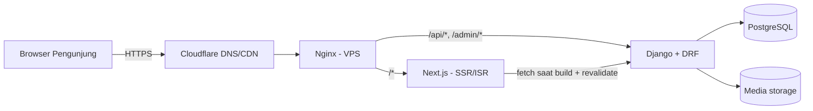
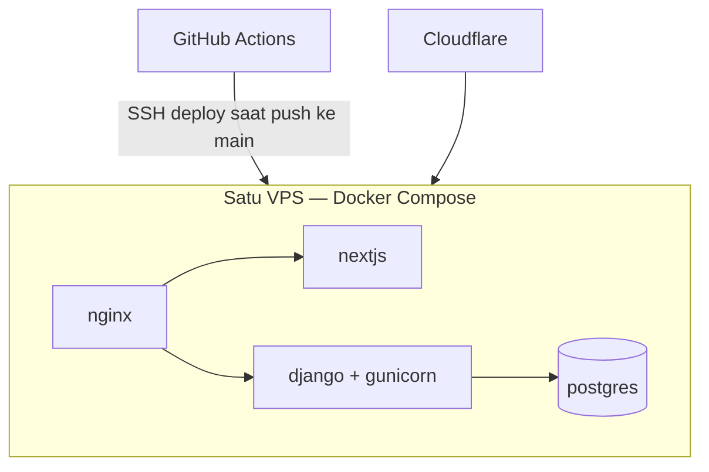

# Website SISO Prasmul — Arsitektur Teknis & Standar Pengembangan

**Owner:** Tim Dev SISO Prasmul | **Status:** Draft v1.0 | **Terakhir diupdate:** Juli 2026
**Diturunkan dari:** `Website_SISO_-_RnD.pdf` (analisis kebutuhan konten)

## 0. Kenapa dokumen ini ada

Ini bukan infrastruktur kampus — dimiliki dan dijalankan penuh oleh HIMA. Baik tim dev maupun BPH berganti tiap tahun. Tanpa standar tertulis, tiap generasi baru harus menerka ulang (atau merusak) keputusan arsitektur dari nol. Dokumen ini adalah source of truth. **Update setiap kali ada keputusan arsitektur yang berubah** — jangan biarkan dokumen ini tidak terupdate.

Dua audiens yang akan baca ini:
1. **Tim dev berikutnya** (teknis) — semua bagian di bawah.
2. **Admin konten / divisi Medkominfo** (non-teknis) — cukup baca point ke-4 (cara toggle konten) dan login Django Admin.

---

## 1. Definition of Done (hal wajib)

- [ ] Setiap section konten bisa di-toggle + diurutkan dari Django Admin — tanpa perlu deploy kode
- [ ] Anggota BPH non-teknis bisa update teks/foto tanpa menyentuh kode
- [ ] `docker compose up` langsung menjalankan seluruh environment dev lokal dalam satu perintah
- [ ] Lighthouse: SEO ≥ 90, Performance ≥ 85 di halaman Home dan About
- [ ] Semua secret ada di `.env`, tidak pernah di-commit; `.env.example` selalu update
- [ ] Onboarding dev baru < 1 hari dengan dokumen ini + README
- [ ] Checklist serah terima kredensial (point ke-14) selesai dijalankan tiap pergantian generasi BPH

---

## 2. Tech Stack

| Layer | Pilihan | Alasan |
|---|---|---|
| Frontend | **Next.js 14+ (App Router, TypeScript)** | SSR/ISR untuk SEO, `next/image` untuk performa, routing berbasis file cocok langsung dengan struktur halaman di PDF |
| Backend | **Django + Django REST Framework** | Django Admin *itu sendiri* jadi CMS — tidak perlu bangun panel admin terpisah. Jalan tercepat memenuhi requirement "toggle section" |
| Database | **PostgreSQL** | Gratis, robust, mendukung JSONField (dipakai untuk config section yang fleksibel) |
| Media | Volume lokal di belakang Nginx dulu → migrasi ke S3-compatible (Cloudflare R2 / Backblaze) kalau storage sudah mepet kapasitas VPS | Hindari biaya prematur, jalur migrasi ke depan murah |
| Reverse proxy | **Nginx** | Route `/` → Next.js, `/api/*` dan `/admin/*` → Django |
| Containerization | **Docker Compose** | Satu perintah untuk semua dev berikutnya — ini keputusan dengan leverage tertinggi untuk kontinuitas serah terima |
| DNS/CDN | **Cloudflare** (free tier) | Memisahkan domain dari VPS; SSL/CDN/proteksi DDoS gratis; bisa pindah VPS provider tanpa utak-atik registrar |
| Hosting | Satu VPS (lihat point ke-8) | Profil traffic (website organisasi mahasiswa) tidak butuh lebih dari ini |

---

## 3. Arsitektur Sistem



Django adalah satu-satunya source of truth untuk konten. Next.js **hanya konsumen read-only** dari API Django — tidak pernah menulis konten secara langsung. Ini menjaga mental model tetap sederhana: *konten hidup di Django Admin, tampilan hidup di Next.js.*

**Strategi rendering:** ISR (Incremental Static Regeneration). Halaman digenerate secara statis dan revalidate berkala (misal 60 detik untuk Home, 5 menit untuk Articles) atau on-demand lewat API route revalidation di Next.js yang dipicu webhook `post_save` dari Django. Hasilnya kecepatan & SEO setara static site tanpa perlu rebuild manual tiap BPH edit konten.

---

## 4. Sistem Toggle Konten (mekanisme inti)

Setiap section di website SISO harus ada togglenya. Satu model generik menggerakkan semua konten opsional/urutan di semua halaman.

```python
# backend/content/models.py
class Section(models.Model):
    PAGE_CHOICES = [
        ("home", "Home"), ("about", "About SISO"),
        ("program", "Program Kerja & Events"), ("contact", "Contact"),
    ]
    page = models.CharField(max_length=30, choices=PAGE_CHOICES)
    section_type = models.CharField(max_length=50)   # contoh: "hero", "video_profile", "prestasi", "timeline"
    is_visible = models.BooleanField(default=True)
    order = models.PositiveIntegerField(default=0)
    config = models.JSONField(default=dict, blank=True)  # konten per-section yang fleksibel

    class Meta:
        ordering = ["page", "order"]
```

```python
# backend/content/admin.py
@admin.register(Section)
class SectionAdmin(admin.ModelAdmin):
    list_display = ("page", "section_type", "is_visible", "order")
    list_editable = ("is_visible", "order")   # <- toggle + reorder, inline, tanpa reload halaman
    list_filter = ("page", "is_visible")
```

Next.js fetch `GET /api/v1/sections?page=home&visible=true`, sudah terurut, dan hanya render yang dikembalikan. Matikan "Video Profile (OPSIONAL)" tinggal centang di Django Admin — tanpa deploy.

Rekomendasi pakai `django-admin-interface` atau `django-unfold` untuk tampilan admin yang lebih rapi, karena akan dipakai langsung oleh anggota BPH non-teknis.

---

## 5. Data Model (dipetakan dari PDF)

| Model | Field kunci | Sumber di PDF |
|---|---|---|
| `Organization` (singleton) | slogan, visi, misi, nilai, filosofi_logo, logo | About SISO |
| `BPHMember` | name, photo, role, division (FK), order, generation_year | Struktur Kepengurusan |
| `Division` | name, group_photo, jobdesc, order | Struktur Kepengurusan |
| `ProgramKerja` | title, category (event/workshop/seminar/competition/pengmas), description, date, cover_image, is_visible | Program Kerja & Events |
| `MediaAsset` | file, type (photo/video), program (FK) | Dokumentasi kegiatan |
| `Achievement` | student_name, title, description, date, image | Prestasi mahasiswa |
| `Article` | title, slug, body, category (jurnal/kajian/achievement/beasiswa), published_at, is_visible | Articles/News |
| `ContactInfo` (singleton) | email, instagram, tiktok, youtube, spotify, whatsapp, line, location, maps_embed | Contact |
| `FAQ` | question, answer, order, is_visible | Contact (opsional) |
| `Section` | lihat point ke-4 | Mekanisme toggle, cross-cutting |
| `FormSubmission` | type (kritik_saran / request_seminar), payload (JSON), created_at | Form kontak |

`generation_year` di `BPHMember` lebih penting dari kelihatannya — ini yang memungkinkan riwayat BPH tersimpan, bukan tertimpa tiap pergantian tahun.

---

## 6. Peta Route / Halaman

| Route | Halaman | Catatan |
|---|---|---|
| `/` | Home | hero, highlight, CTA — semua dibangun dari `Section` |
| `/about` | About SISO | visi misi, struktur, nilai |
| `/about/divisi/[slug]` | Detail divisi | foto grup, jobdesc, anggota |
| `/program-kerja` | Listing Program Kerja & Events | filter by category |
| `/program-kerja/[slug]` | Detail event | deskripsi, dokumentasi, pengurus |
| `/articles` | Listing Articles/News | filter by category |
| `/articles/[slug]` | Detail artikel | |
| `/contact` | Contact | form, maps, sosial media |
| `/admin` (atau `cms.sisoprasmul.com`) | Django Admin | staff-only, idealnya subdomain terpisah |

**Header / Footer / Loading Page** bukan route — melainkan `layout.tsx` (header/footer, persist di semua halaman) dan `loading.tsx` (splash/skeleton) di Next.js.

---

## 7. Kontrak API (v1)

```
GET  /api/v1/sections?page=home&visible=true
GET  /api/v1/organization
GET  /api/v1/members
GET  /api/v1/divisions
GET  /api/v1/programs?category=&visible=true
GET  /api/v1/programs/{slug}
GET  /api/v1/articles?category=
GET  /api/v1/articles/{slug}
GET  /api/v1/contact
GET  /api/v1/faq
POST /api/v1/contact/submissions
```

Versi-kan API sejak hari pertama (`/api/v1/`) — kalian *akan* butuh ubah backend lintas generasi tanpa merusak frontend yang mungkin dipegang generasi berbeda.

---

## 8. Infrastruktur & Deployment



- **Domain:** `sisoprasmul.com`, DNS dikelola di Cloudflare (bukan langsung di registrar)
- **VPS:** provider apapun yang support Docker, RAM 2GB cukup. Provider lokal (IDCloudHost, Niagahoster, Biznet Gio) beri billing IDR + support lokal; DigitalOcean/Vultr (~$6–12/bulan) beri lebih banyak tutorial komunitas. Keduanya oke — pilih sesuai siapa yang bayar dan pakai mata uang apa.
- **SSL:** Cloudflare mode "Full (strict)", atau Certbot langsung di VPS kalau tidak proxy lewat Cloudflare
- **Services di `docker-compose.yml`:** `nextjs`, `django`, `postgres`, `nginx` — satu file, satu perintah, jalan identik di laptop dev manapun ke depannya maupun di VPS

---

## 9. CI/CD

- GitHub Actions saat push ke `main`: SSH ke VPS → `git pull` → `docker compose build` → `docker compose up -d`
- Strategi branch: `main` (prod), `dev` (staging/testing), feature branch, PR wajib sebelum merge ke `main`
- Jaga pipeline tetap sederhana — tim mahasiswa yang bergilir tidak diuntungkan oleh setup deploy rumit yang tidak bisa mereka debug jam 1 pagi sebelum launch

---

## 10. Environment

| Env | Fungsi | DB |
|---|---|---|
| Local | `docker-compose.dev.yml`, hot reload | Postgres container lokal |
| Staging *(direkomendasikan, opsional kalau budget terbatas)* | `staging.sisoprasmul.com`, testing sebelum tiap push konten proker | instance/DB Postgres terpisah |
| Production | `sisoprasmul.com` | Postgres production |

---

## 11. Standar SEO & Performa

- `next/metadata` per route: title, description, Open Graph (penting banget untuk sharing link di Instagram)
- `sitemap.xml` dan `robots.txt` otomatis
- `next/image` untuk semua gambar — tidak ada `` mentah
- Schema JSON-LD `Organization` di homepage
- Target: Lighthouse SEO ≥ 90, Performance ≥ 85

---

## 12. Keamanan & Secret

- Semua secret di `.env`, jangan pernah di-commit. Selalu update `.env.example` dengan placeholder key
- `SECRET_KEY` Django, kredensial DB, API key apapun — semua lewat env var
- **Vault bersama** (Bitwarden org vault, free tier cukup) untuk: SSH key VPS, login registrar domain, login Cloudflare, akses GitHub org, superuser Django admin. Ini hal yang paling sering hilang saat serah terima tim tech HIMA — siapkan sebelum dibutuhkan
- Akun Django Admin dipisah per orang (ketua divisi punya akun sendiri, bukan satu login bersama)

---

## 13. Struktur Repo & Standar Kode

**Monorepo** — `/frontend` (Next.js) + `/backend` (Django) dalam satu repo Git. Serah terima lebih simpel dibanding dua repo terpisah.

- Frontend: ESLint + Prettier
- Backend: Black + isort + flake8
- Commit: Conventional Commits (`feat:`, `fix:`, `chore:`) — bikin `git log` mudah dibaca tim dev dua generasi setelah kalian
- `README.md` di root repo: instruksi setup, link ke dokumen ini

---

## 14. Protokol Serah Terima (pergantian tahunan BPH/dev)

Checklist yang dijalankan **setiap kali** tim berganti:

- [ ] Transfer akses VPS (SSH key baru ditambahkan, yang lama dicabut)
- [ ] Transfer akses registrar domain + akun Cloudflare
- [ ] Transfer ownership GitHub org / tambahkan dev baru sebagai collaborator
- [ ] Rotasi password Django admin, update vault bersama
- [ ] Jelaskan dokumen ini + praktik deploy langsung ke tim dev baru
- [ ] Arsipkan data BPH generasi keluar (jangan dihapus — pakai `generation_year`)

---

## 15. Roadmap Pembangunan

1. **Backend dulu:** model (point ke-5) + Django Admin, karena PDF pada dasarnya adalah struktur konten
2. **Skeleton frontend:** layout, routing, design system
3. **Integrasi:** sambungkan Next.js ke API Django, implementasi rendering `Section`
4. **Polish:** SEO, performa, QA responsive
5. **Deploy:** VPS + domain + dokumen ini difinalisasi dan di-commit ke repo